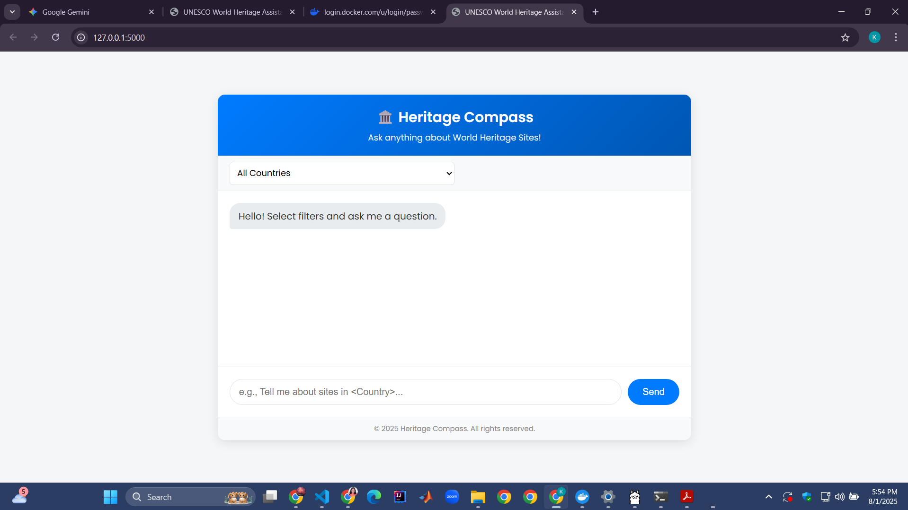

# 🏛️ Heritage Compass: AI-Powered UNESCO World Heritage Guide

Heritage Compass is an interactive, full-stack web application that acts as an AI-powered knowledge assistant for UNESCO World Heritage Sites. It leverages a sophisticated Retrieval-Augmented Generation (RAG) architecture to provide accurate, context-aware answers to complex user queries in multiple languages.

 

## ✨ Key Features

* **Advanced RAG Architecture:** Moves beyond simple keyword search by converting a vast knowledge base into vector embeddings. It retrieves the most relevant information using a vector database and uses a Large Language Model (LLM) to generate precise, human-like answers.

* **Dynamic Metadata Filtering:** Users can dynamically filter heritage sites by **Country** and **Category** (Cultural, Natural, Mixed) before asking a question, allowing for highly specific and accurate results.

* **Stable & Reliable Data Pipeline:** Fetches data directly from the **Wikidata SPARQL API**, ensuring a stable and structured data source that is not vulnerable to website layout changes, a common failure point for web scrapers.

* **Interactive Web UI:** A clean, modern, and responsive user interface built with Flask and vanilla JavaScript, providing a seamless user experience.

* **Local First & Cloud Ready:** Can be run entirely on a local machine using Ollama or can be easily configured to use cloud-based LLM APIs like Groq for enhanced performance.

## 📦 Tech Stack

* **Backend:** Python, Flask

* **AI Orchestration:** LangChain

* **Vector Database:** Qdrant (running via Docker)

* **LLM Serving:** Ollama (for local models like Llama 3, Phi-3) or Groq API (for cloud-based models)

* **Data Source:** Wikidata (via SPARQL)

* **Embedding Models:** Hugging Face Transformers (`paraphrase-multilingual-mpnet-base-v2`)

* **Frontend:** HTML, CSS, JavaScript

## 🚀 Setup and Installation

Follow these steps to get Heritage Compass running on your local machine.

### 1. Prerequisites

* **Python 3.9+**

* **Docker Desktop:** Make sure it is installed and running.

* An internet connection for downloading models and dependencies.

### 2. Clone the Repository

```
<<<<<<< HEAD
git clone https://github.com/IyenshiAUT/UNESCO-RAG-App.git
cd "Unesco RAG app"

=======
app.py                # Main Flask application
fetch_and_index.py    # Script to fetch and index UNESCO data
requirements.txt      # Python dependencies
static/
    css/style.css     # Custom styles
    js/script.js      # Custom JavaScript
templates/
    index.html        # Main HTML template
>>>>>>> a9662152db8344319c5c80663c8dd50cabdbd01a
```

### 3. Set Up a Virtual Environment

It's highly recommended to use a virtual environment.

=======
## Setup Instructions

### 1. Clone the repository
```powershell
git clone https://github.com/IyenshiAUT/UNESCO-RAG-App/blob/main/README.md
cd "Unesco RAG App"
```
# Create the virtual environment
python -m venv venv

# Activate it
# On Windows:
.\venv\Scripts\activate
# On macOS/Linux:
source venv/bin/activate

```

### 4. Install Dependencies

Install all the required Python packages.

```
pip install -r requirements.txt

```

### 5. Set Up Services

You need two background services running: Qdrant and Ollama.

* **Start Qdrant Vector Database:**
  Open a terminal and run the Docker command. This will download the Qdrant image and start the container.

  ```
  docker run -p 6333:6333 -p 6334:6334 qdrant/qdrant
  
  ```

  Keep this terminal open.

* **Start and Prepare Ollama:**

  1. Make sure the Ollama desktop application is running.

  2. Open a new terminal and download the LLM you want to use (e.g., `llama3` or the smaller `phi-3`).

     ```
     ollama run llama3
     
     ```

  3. Once the download is complete, you can exit the Ollama chat by typing `/bye`.

### 6. Ingest the Data

This is a one-time step to populate your Qdrant database with knowledge about the heritage sites.

* Run the `fetch_and_index.py` script. This will query Wikidata, fetch details from Wikipedia, and create the vector embeddings. This may take several minutes.

  ```
  python fetch_and_index.py
  
  ```

### 7. Run the Application

Now you are ready to start the main web application.

* In your project terminal (with the virtual environment still active), run the Flask app:

  ```
  python app.py
  
  ```

* Open your web browser and navigate to **http://127.0.0.1:5000**.

You should now see the Heritage Compass interface, ready to answer your questions!

## Usage

1. Navigate to the web interface.

2. (Optional) Use the dropdown menus to filter by **Country**.

3. Type your question into the input box at the bottom.

4. Press **Send** and wait for the AI to generate a response.

## Future Improvements

* **Image Integration:** Display images of the heritage sites alongside the text descriptions.

* **Map View:** Implement an interactive map to visualize the locations of the sites.

* **Conversation History:** Allow the session to remember previous questions for better follow-up queries.

* **Caching:** Implement caching for filter data to improve load times on startup.

## License

This project is licensed under the MIT License.
